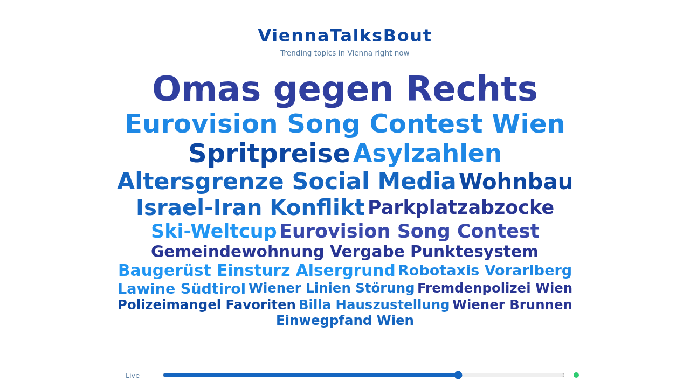

# ViennaTalksBout

ViennaTalksBout is a real-time tag cloud that visualizes what people in Vienna are talking about online right now. It displays 20 trending topics that continuously evolve — fading in as conversations spark, growing as they gain traction, and disappearing as the city moves on. A time slider lets you scrub through the day to see how topics shifted hour by hour. Under the hood, an LLM extracts specific trending terms from live social media streams, so the cloud reflects actual local buzz rather than generic categories.

